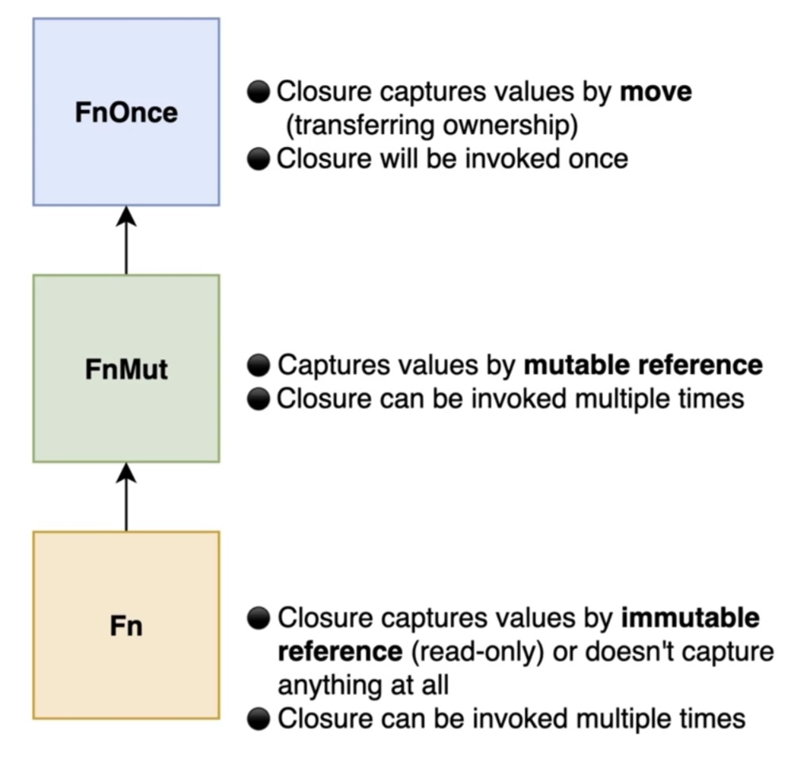

# 🚰 Closures
A **closure** is a function without a name. It is sometimes called an **anonymous function** or a **lambda**. Closures are helpful when we want to declare a quick, one-off procedure that does not really merit an independent function declaration

Closures are a key component of a programming paradigm called **functional programming**. Paradigm means a way of thinking about code and how to structure it. Functional programming treats a function like any other value in a program.

## 📗 **Nested Functions**
Nested functions are functions declared inside another function. However, they do not capture variables from their surrounding environment.

```rust,ignore
fn main() {
    fn multiply_by_two(value: i32) -> i32 {
        value * 2
    }
}

// 'multiply_by_two' cannot scape the boundaries of 'main'

fn other_fun() {
    // multiply_by_two(5);  ❌ Error
}
```
A nested function can only access variables passed explicitly as parameters or variables defined inside its own scope.
```rust,ignore
fn main() {
    let multiplier: i32 = 5;

    fn multiply_by(value: i32) -> i32 {
        // ❌ Error: nested functions cannot capture variables
        // from their surrounding environment
        value * multiplier
    }
}
```
## 📗 **Declare Closures**
Unlike nested functions, closures can capture and use variables from their surrounding environment.
```rust
# fn main() {
let multiplier: i32 = 5;

let multiply_by = |value: i32| -> i32 {
    return value * multiplier;
};

let product = |a: i32, b: i32| -> i32 {
    return a * b;
};

println!("{}", multiply_by(2));
println!("{}", product(3, 4));
# }
```
There are several **shortcuts** that we can apply to **closures** that we cannot apply to plain functions 
```rust
# fn main() {
let return_five = || 5;
let return_five_unsigned = || 5 as u8;

let multiplier: i32 = 5;
// This is not a generic, 
// Rust infer the type for the 'value' parameter in the first call
let multiply_by = |value| value * multiplier; 

println!("{}", return_five());
println!("{}", return_five_unsigned());
println!("{}", multiply_by(2));
# }
```

## 📘 **`Fn trait` Hierarchy**
These three traits form a hierarchy:
```text
Fn
 ↓
FnMut
 ↓
FnOnce
```
This means that a function requiring `FnOnce` can accept an `FnOnce`, `FnMut`, or `Fn` closure:
```rust,ignore
fn execute_once<F>(closure: F)
where
    F: FnOnce(),
{
    closure();
}
```
A function requiring `FnMut` can accept an `FnMut` or `Fn` closure:
```rust,ignore
fn execute_twice<F>(mut closure: F)
where
    F: FnMut(),
{
    closure();
    closure();
}
```
A function requiring `Fn` can only accept an `Fn` closure:
```rust,ignore
fn execute_read_only<F>(closure: F)
where
    F: Fn(),
{
    closure();
    closure();
}
```
`Fn` is the most restrictive trait because it imposes the strongest guarantees. `FnOnce` is the least restrictive because every closure implements it.



## 📘 **Closures that Capture Immutable References**
If a closure only reads a captured variable, Rust usually captures it through an immutable reference. Such a closure implements `Fn`.
```rust
# fn main() {
// Vectors do not implement the Copy trait
let numbers = vec![4, 8, 15, 16, 23, 42];

let print_numbers = || println!("{:?}", numbers); // impl Fn

print_numbers();
# }
```
## 📘 **Closures that Capture Mutable References**
If a closure modifies a captured variable, Rust captures it through a mutable reference. Such a closure implements `FnMut`.
```rust
# fn main() {
// Vectors do not implement the Copy trait
let mut numbers = vec![4, 8, 15, 16, 23, 42];

let mut push_number = || numbers.push(100); // impl FnMut()

push_number();

println!("{:?}", numbers);
# }
```

## 📘 **Closures with Ownership and `move`**
Closures can take ownership:
```rust
# fn main() {
let number: i32 = 15;

let capture_number = || number; // impl Fn

println!("{}", capture_number());

let first_name: String = String::from("George");

let capture_string = || first_name; // impl FnOnce

println!("{}", capture_string());
# }
```
The `move` keyword forces a closure to take ownership of the variables it captures
```rust
# fn main() {
let first_name: String = String::from("George");

let print_name = move || println!("{}", first_name); // impl Fn

print_name();
print_name();
# }
```

## 📙 **`unwrap_or_else` Method**
`unwrap_or_else` returns the value inside an `Option` when it is `Some`.

If the `Option` is `None`, it evaluates the closure and uses the closure's return value as the fallback.

The closure is evaluated lazily, which means that it is only executed when the `Option` is `None`.
```rust,editable
fn main() {
    let option = Some("Salami");
    // let option = None;

    let food = option.unwrap_or_else(|| "Pizza");

    println!("{}", food);
}
```
A closure passed to `unwrap_or_else` can also contain more complex logic:
```rust,editable
fn main() {
    let option = Some("Salami");
    // let option = None;

    let pizza_fan = false;
    let food = option.unwrap_or_else(|| { if pizza_fan { "Pizza" } else { "Hot Pockets" } });

    println!("{}", food);
}
```
## 📙 **`String.retain` Method**
The `retain` method removes characters from a `String` when the provided closure returns `false`.

The closure receives each character as a `char` and must return a `bool`:
```rust
# fn main() {
let mut game_console: String = String::from("PlayStation");

game_console.retain(|character| character != 'a');

println!("{}", game_console);
# }
```


## 📕 **Methods with Closures as Parameters**
Rust allows methods and functions to receive closures as parameters. This is useful when part of the behavior should be provided by the caller.

To accept a closure, we use a generic type parameter together with one of the closure traits: `Fn`, `FnMut`, or `FnOnce`.

### **`FnOnce` Trait**

```rust,editable
struct Vault {
    password: String,
    treasure: String
}

impl Vault {
    fn unlock<F>(self, procedure: F) -> Option<String>
    where
        // The closure has no parameters and return a String
        F: FnOnce() -> String
    {
        let user_password = procedure();
        if user_password == self.password {
            Some(self.treasure)
        } else {
            None
        }
    }

}
fn main() {
    let vault = Vault { 
        password: "topsecret".to_string(),
        treasure: "Gold".to_string()
    };

    println!("{:?}",vault.unlock(|| "topsecret".to_string()));
}
```

### **`FnMut` Trait**

```rust,editable
struct Location {
    name: String,
    treasures: u32,
}

struct Map<'a> {
    locations: &'a [Location],
}

impl<'a> Map<'a> {
    fn explore<F>(&self, mut action: F)
    where
        F: FnMut(&Location),
    {
        for location in self.locations {
            action(location);
        }
    }
}

fn main() {
    let locations = [
        Location {
            name: "Enchanted Forest".to_string(),
            treasures: 5,
        },
        Location {
            name: "Mystic Mountain".to_string(),
            treasures: 5,
        },
    ];

    let map = Map {
        locations: &locations,
    };

    let mut total_treasures: u32 = 0;

    map.explore(|location| {
        total_treasures += location.treasures;
    });

    println!("Total treasures: {total_treasures}");
}
```


### **`Fn` Trait**
The `Fn` trait is used for closures that can be called through an immutable reference to their environment.

A closure implements `Fn` when it does not modify or consume any of the values it captures. Because it can be called repeatedly without changing its environment, it is safe to invoke it multiple times.

```rust,editable
fn execute_trice<F>(procedure: F)
where
    F: Fn()
{
    procedure();
    procedure();
    procedure();
}

fn main() {
    let closure = || println!("I am the Boss");
    execute_trice(closure);
}
```
We can pass in a function to `Fn` trait parameter

```rust
fn execute_trice<F>(procedure: F)
where
    F: Fn()
{
    procedure();
    procedure();
    procedure();
}

fn main() {
    let option: Option<Vec<String>> = None;

    let collection = option.unwrap_or_else(Vec::new);

    println!("{:?}", collection);
}
```